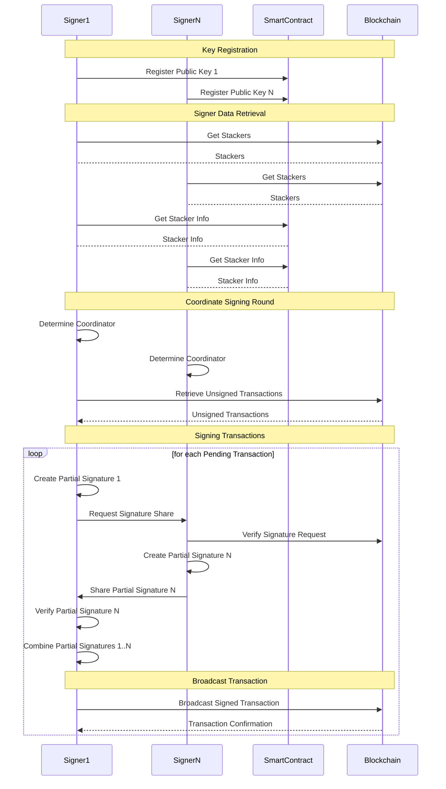
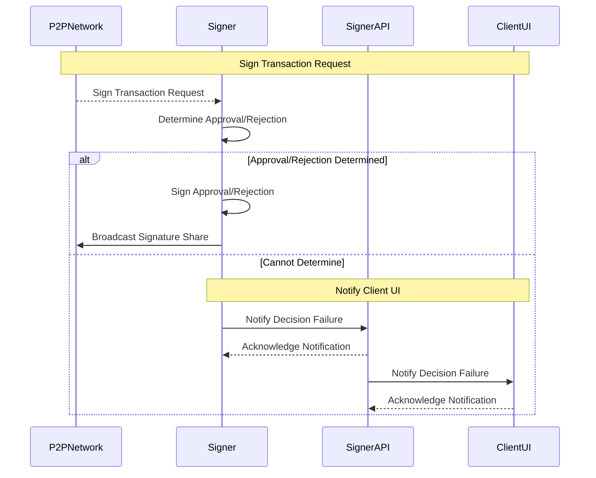
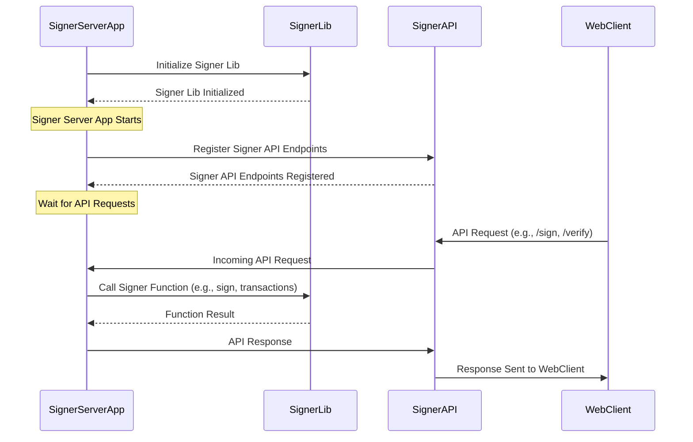

The following sequence diagrams illustrate the communication process between DKG signers (Signer 1, Signer 2, ..., Signer N) and the Smart Contract in the Stacks blockchain. It shows the sequence of events and flow of data between the signers, the smart contract, and the blockchain for key registration, signer coordination, message signing, and signature verification. Note that communication between signers is through a P2P Network.

This diagram shows the sequence of events that occur when a signer receives sign requests for a transaction from the P2P Network. For each transaction, it determines whether to approve or reject it based on the signer's configuration. If the Signer can determine the decision, it signs the transaction and broadcasts its share to the P2P network. If the Signer cannot determine the decision, the Signer API notifies the client UI about the decision failure and requests a manual review.

The following sequence diagram shows how a signer server app initializes and interacts with a signer lib, and how it registers and responds to requests via a signer API. The server app relies on the signer lib for cryptographic functions like signing and verifying, while the signer API provides a way for external clients such as a Web Client to interact with the signer server app.

